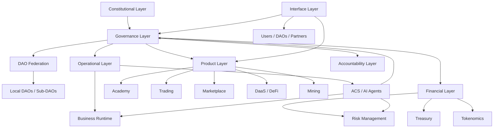

# Axodus Architecture

Status: Draft
Version: 0.1.0
Last Updated: 2026-05-16
Owner: Axodus Core

---

## Purpose

This document describes the high-level Axodus ecosystem architecture.

## Scope

It covers the conceptual architecture, major nuclei, governance coordination model, treasury and risk layers, ACS support layer, and relationship between users, DAOs, partners, and product infrastructure. It does not define final smart contract parameters, token mechanics, deployment addresses, or legal structures.

## Architecture Summary

Axodus is organized as a governed, modular ecosystem. Governance coordinates product access, treasury decisions, constitutional alignment, DAO federation, plugin approvals, risk review, and public accountability.

The ecosystem is composed of nuclei that each own a specific domain, workflow, governance relation, and risk profile:

- Governance coordinates decisions and execution.
- Business receives and manages formal requests.
- Academy handles onboarding, education, Proof of Knowledge, and token utility flows.
- Trading supports internal financial infrastructure and user-facing strategy products.
- Treasury manages institutional capital allocation, reporting, and risk constraints.
- ACS / AI Agents support analysis, classification, risk review, and operations.
- Marketplace commercializes products, courses, licenses, services, and access mechanisms.
- Tokenomics aligns incentives through `$Neurons` utility, rewards, governance participation, and access logic.
- Accountability publishes records, reports, release notes, and governance execution evidence.
- Security protects contracts, wallets, APIs, governance workflows, treasury execution, and disclosure processes.

## Architectural Layers

Axodus should be understood through layered responsibilities:

| Layer | Purpose | Includes |
| --- | --- | --- |
| Constitutional | Define values, guardrails, DAO federation rules, and accountability expectations | Constitution, governance principles, federation eligibility, ecosystem constraints |
| Governance | Coordinate decisions, proposals, approvals, treasury-sensitive actions, and legitimacy | Executive DAO, Boardroom Council, Community DAO, lifecycle, execution records |
| Operational | Convert requests into structured work and delivery | Business, ACS runtime, service catalog, milestones, change requests |
| Product | Provide ecosystem-facing and user-facing capabilities | Academy, Trading, Mining, Marketplace, DaaS / DeFi, BBA, Lottery, MCPs |
| Financial | Manage capital, incentives, rewards, liquidity, and exposure | Treasury, Tokenomics, Rewards, Risk Management, ETF DaaS concepts |
| Intelligence | Assist analysis, classification, monitoring, and operational reasoning | ACS, Morpheus, Trinity, Agent Smith, future agents, MCP integrations |
| Accountability | Make decisions, releases, financial activity, and governance outcomes traceable | Reports, release notes, governance records, treasury summaries, incident records |
| Interface | Expose ecosystem functions to users and operators | Documentation portal, dashboards, governance UI, Marketplace UI, Academy UI, APIs |

## Conceptual Diagram

## Governance as Coordination Layer

Governance is the heart of Axodus. It does not only vote; it coordinates constitutional alignment, treasury execution, product access, DAO federation, plugin requests, and accountability obligations.

## Business as Intake and Service Layer

Business is the formal runtime for client, DAO, partner, and internal requests. It classifies work, defines scope, identifies governance requirements, manages approvals, tracks milestones, handles change requests, and archives outcomes.

## Academy as Education and Token Utility Layer

Academy introduces users to Axodus through education, Learn-to-Win, Proof of Knowledge, certification, tutor validation, course publishing, and cautious reward logic. Token behavior must remain tied to implemented contract rules.

## Trading as Financial and Product Layer

Trading is both an internal strategy infrastructure nucleus and a user-facing product line. It may support treasury strategies, strategy subscriptions, and API-based user tools. Trading documentation must make risk, user control, and no guaranteed profit explicit.

## Treasury, Risk, and Accountability

Treasury is an institutional capital layer. It requires governance oversight, allocation limits, risk classification, reporting cadence, and public accountability. Accountability is mandatory, not optional.

## ACS as Operational Intelligence

ACS agents support analysis, validation, risk review, documentation, monitoring, and decision support. They do not replace governance, human review, security review, or final accountability.

## System Boundaries

- Public documentation explains the ecosystem, educates contributors, and avoids private operational secrets.
- Knowledge packs under `.knowledge` provide semantic memory for agents and documentation generation. They are not public-facing documentation by default.
- `/Documents` stores planning material, drafts, research, and historical context.
- Source code repositories remain the source of truth for implementation, contracts, UI, backend, and deployment automation.

## Architecture Invariants

- Every nucleus must have a clear purpose.
- Every financial flow must include risk context.
- Every governance action must be traceable.
- Every Business request must have scope and status.
- Every agentic output must be reviewable.
- Every token reward flow must be contract-defined or policy-defined before being described as final.
- Every public claim must match actual implementation status.

## Status

This architecture is a current design foundation. Final implementations, contracts, integrations, and governance parameters require separate validation.
