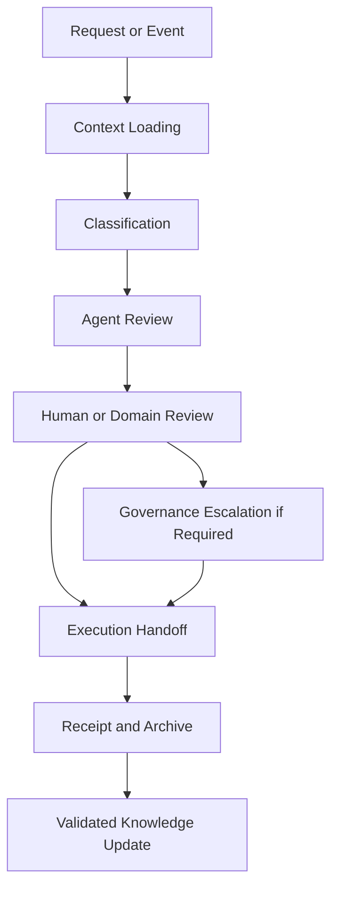

# ACS Architecture

Status: Draft  
Version: 0.1.0  
Last Updated: 2026-05-16  
Owner: ACS Nucleus

---

## Purpose

This document describes the ACS architecture.

## Scope

It covers agent identity, orchestration, semantic memory, tools and MCPs, review boundaries, execution handoff, audit records, and integration surfaces.

## Overview

ACS must be a layered system, not a set of disconnected agents. This separation prevents unsafe automation, uncontrolled tool access, context drift, and unclear responsibility.

## Architecture Layers

| Layer | Responsibility |
| --- | --- |
| Agent Identity | Define agent roles, scope, expected outputs, boundaries, and forbidden actions. |
| Orchestration | Route tasks, coordinate multi-agent review, classify risk, request review, and escalate. |
| Knowledge | Store semantic memory, knowledge packs, documentation context, and retrieval material. |
| Tool / MCP | Expose connectors under permissions, logging, scoping, and safe defaults. |
| Review | Support human, governance, security, treasury, and product owner validation. |
| Execution Handoff | Prepare tasks, governance payloads, documentation updates, and checklists without unapproved direct execution. |
| Audit | Preserve logs, outputs, decision context, and links to actions and accountability reports. |

## Conceptual Flow

## Core Runtime Components

- Task router
- Context loader
- Classifier
- Agent executor
- Reviewer
- Tool gateway
- Memory writer
- Audit logger

## Collaboration Models

Low-risk tasks may use single-agent review. Strategic or financial tasks may use dual-agent review. High-risk proposals, reward policies, treasury actions, plugin requests, or trading strategies should include adversarial review. Major governance-sensitive tasks may use council-style review with Morpheus, Trinity, Agent Smith, and a human or governance reviewer.

## Integration Surfaces

ACS may integrate with Business, Governance, GitHub, documentation, operations, Trading, Treasury, Academy, Marketplace, Security, and Accountability. Each surface requires clear permission and review boundaries.

## Future Work

Final runtime services, schemas, logs, and MCP permissions require implementation validation.
