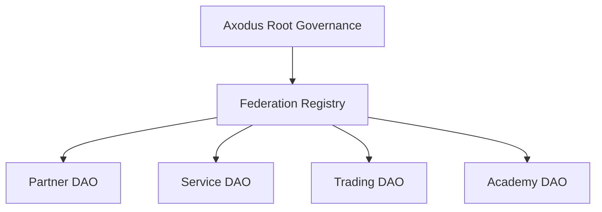

# DAO Federation

Status: Draft  
Version: 0.1.0  
Last Updated: 2026-05-16  
Owner: Governance Nucleus

---

## Purpose

DAO federation allows autonomous DAOs to operate under shared Axodus constitutional principles while retaining local autonomy.

## Scope

This document covers hub-and-spoke governance, canonical authority, local autonomy, registry concepts, product access, and cross-DAO coordination.

## Model

Axodus uses a federation concept because a pure monolithic DAO would be too rigid for a modular ecosystem, while an unstructured set of DAOs would be too fragmented and risky.

## Federation Actors

- Axodus Core Governance maintains constitutional references, recognizes federated DAOs, coordinates ecosystem policy, publishes records, and supervises product access rules.
- Local DAOs maintain local governance, respect guardrails, document local decisions, request custom plugins when needed, and report relevant execution events.
- Business receives DAO service requests, classifies plugin or integration needs, coordinates scoping, and routes governance-sensitive requests.
- ACS assists alignment review, summarizes DAO context, classifies risk, detects missing information, and produces advisory outputs.
- Boardroom Council reviews high-risk federation requests, plugin requests, treasury-sensitive DAO requests, and constitutional alignment.

## Local DAO Autonomy

Local DAOs may define internal workflows, member rules, service models, plugins, dashboards, and treasury policies within constitutional limits.

Local DAOs may choose voting rules, request custom plugins, define local discussion processes, set local service priorities, and operate community-specific workflows. They may not bypass the Axodus Constitution, make false financial claims using the Axodus brand, access treasury-sensitive products without review, deploy unreviewed critical plugins as official components, hide material execution information, or override federation status controls.

## Federation Registry Concept

A future federation registry may record DAO identity, network, governance framework, primary contracts, alignment status, federation status, product access status, approved plugins, restricted plugins, risk level, last review date, responsible nucleus, documentation URL, and execution receipt URL.

## Proposed Federation Statuses

| Status | Meaning |
| --- | --- |
| Candidate | DAO has requested or is being evaluated for federation. |
| Federated | DAO is recognized under current rules. |
| Conditional | DAO has limited access or pending requirements. |
| Suspended | DAO temporarily loses access due to risk or review. |
| Revoked | DAO is no longer recognized as aligned. |
| Archived | DAO is preserved as a historical record but not active. |

## Product Access

Capital-sensitive product access should depend on constitutional alignment, governance standing, risk classification, and product-specific requirements.

Product access may be open, gated, governance-approved, restricted, or denied. Access state should be based on federation status, constitutional alignment, risk review, and product-specific rules.

## Federation Lifecycle

1. Discovery or application
2. Intake
3. Identity and scope review
4. Constitutional alignment review
5. Risk classification
6. Plugin and product needs review
7. Governance layer assignment
8. Approval or conditional status
9. Registry entry creation
10. Product access configuration
11. Ongoing monitoring
12. Periodic review
13. Suspension or revocation if required

## Future Work

Federation registry implementation, standing statuses, suspension flows, and cross-DAO execution standards require further specification.
