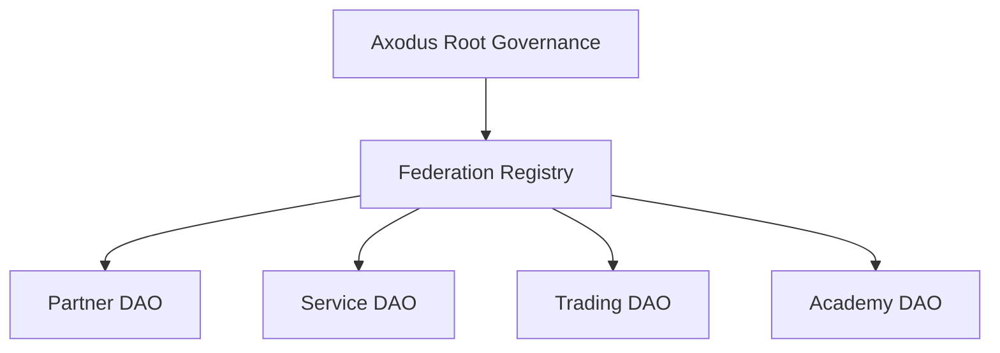

# DAO Federation

Status: Draft  
Version: 0.1.0  
Last Updated: 2026-05-16  
Owner: Governance Nucleus

---

## Purpose

DAO federation allows autonomous DAOs to operate under shared Axodus constitutional principles while retaining local autonomy.

## Scope

This document covers hub-and-spoke governance, canonical authority, local autonomy, registry concepts, product access, and cross-DAO coordination.

## Model

## Local DAO Autonomy

Local DAOs may define internal workflows, member rules, service models, plugins, dashboards, and treasury policies within constitutional limits.

## Product Access

Capital-sensitive product access should depend on constitutional alignment, governance standing, risk classification, and product-specific requirements.

## Future Work

Federation registry implementation, standing statuses, suspension flows, and cross-DAO execution standards require further specification.
