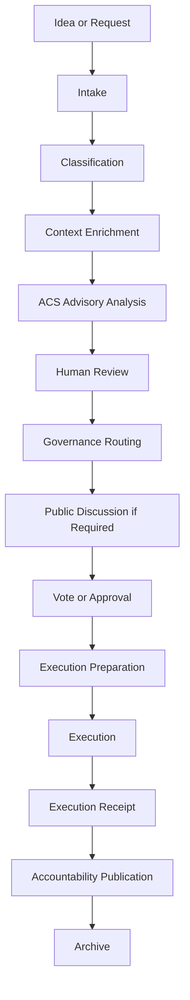

# Proposal Lifecycle

---

## Purpose

This document defines how Axodus governance proposals move from intent to accountable execution.

## Scope

It covers proposal types, required metadata, lifecycle stages, risk-based routing, ACS analysis, execution receipts, and accountability publication.

## Overview

A governance proposal is not only a vote. A proposal is a structured decision object that preserves context, classifies risk, identifies affected nuclei, defines execution requirements, routes review to the proper governance layer, and generates records after execution.

## Proposal Types

- Strategic: roadmap, ecosystem direction, or nucleus priority.
- Technical: smart contract updates, frontend or backend changes, infrastructure integrations, registry updates, or plugin deployments.
- Treasury: capital allocation, spending approval, strategy changes, exposure changes, or reporting policy.
- Product: product nucleus creation, product access policy, Marketplace rules, Academy rewards, or Trading access.
- Federation: DAO admission, suspension, federation registry updates, or local DAO product access.
- Plugin: governance plugin, voting plugin, DAO-specific extension, or plugin parameter change.
- Accountability: report publication, release note policy, treasury report, or governance record updates.
- Emergency: exploit response, treasury protection, contract pause, or urgent security action.

## Required Metadata

Every material proposal should include title, summary, author or sponsor, responsible nucleus, proposal type, current status, requested action, affected systems, governance layer required, risk level, execution requirements, treasury impact, security impact, product impact, tokenomics impact, ACS analysis status, review requirements, execution plan, rollback or mitigation plan, and accountability output.

Recommended metadata includes reason codes, dependencies, milestone links, implementation PR links, contract addresses if known, chain ID if known, affected frontend routes, federation records, public discussion links, and decision deadline if any.

## Lifecycle

## Risk-Based Review

| Risk | Examples | Review |
| --- | --- | --- |
| Low | Documentation update, non-sensitive UI copy, process clarification | Nucleus owner or documentation review |
| Medium | Service runtime change, product policy change, non-treasury integration | Nucleus review, ACS optional, governance visibility |
| High | Treasury action, smart contract change, custom plugin, token reward policy, Trading access policy | ACS analysis, human review, governance review, risk disclosure, receipt, accountability output |
| Critical | Exploit response, treasury emergency, constitutional exception | Emergency review, security review, treasury or Boardroom review, public post-action report, rollback or containment plan |

## Governance Touchpoints

The responsible route may involve Executive DAO sponsorship, Boardroom review, Community DAO discussion or vote, Business intake, ACS analysis, Treasury review, Security review, or Accountability publication.

## Risk Considerations

Vague proposals, missing execution plans, unclear treasury impact, missing rollback plans, or undefined ownership can create governance and operational risk.

## Current Status

This lifecycle is a documentation and process model. Final tooling, forms, status automation, and voting parameters require implementation validation.
