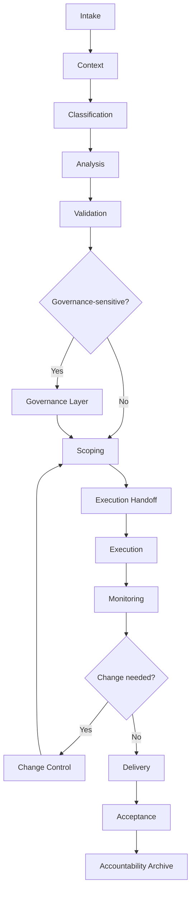

# Runtime Architecture

---

## Purpose

Runtime architecture separates operational concerns so request intake, analysis, governance approval, scoping, execution, validation, and accountability do not collapse into one informal workflow.

## Scope

This architecture is transversal and can be reused by Business, Governance, ACS, Academy, Trading, Treasury, Marketplace, BBA, documentation, and technical delivery.

Its integration surfaces are conceptual and documentation-governed unless
separately verified. They do not, by themselves, prove live production
integration, active providers, or enabled execution channels.

## Architecture Layers

- Intake layer: captures request, requester, source, and initial context.
- Context layer: gathers existing documentation, knowledge packs, related nuclei, and previous records.
- Classification layer: assigns domain, request type, risk level, governance touchpoints, and required reviews.
- Analysis layer: supports ACS summaries, missing information detection, risk flags, and recommendations.
- Validation layer: handles human review, domain review, correction of agent output, and readiness confirmation.
- Governance layer: routes proposals, constitutional review, DAO federation review, treasury review, tokenomics review, and formal approval.
- Scoping layer: defines deliverables, boundaries, assumptions, acceptance criteria, and milestones.
- Execution layer: transfers approved work to Coder, operators, governance executors, or implementation teams.
- Monitoring layer: tracks milestones, blockers, delays, and status updates.
- Change control layer: records requested changes, classifies impact, and routes reapproval when needed.
- Acceptance layer: validates deliverables, records acceptance or rejection, and lists unresolved items.
- Accountability layer: creates execution receipts, governance records, delivery records, and archives final context.

## Runtime Data Objects

Core runtime objects include `RuntimeItem`, `IntakeRecord`, `ClassificationRecord`, `ReviewRecord`, `ScopeRecord`, `MilestoneRecord`, `ChangeRequestRecord`, `HandoffRecord`, `AcceptanceRecord`, and `AccountabilityRecord`.

Each material object should include status, owner, risk level, next action, related records, and evidence links where applicable.

## Integration Surfaces

- Governance: proposal lifecycle, execution receipts, DAO federation, and governance records.
- Business: request intake, service scope, client lifecycle, change requests, and acceptance.
- ACS: task analysis, agent review, risk classification, documentation support, and handoff generation.
- Academy: course review, reward policy, tutor validation, and Marketplace course flows.
- Trading: strategy access, API key review, risk reports, and user readiness.
- Treasury: allocation review, exposure reporting, and treasury action approval.
- Marketplace: listing review, payment policy, dispute flows, and fee records.
- Documentation: docs generation, knowledge pack updates, navigation, and release notes.
- GitHub or Coder: implementation tasks, pull requests, review, and release records.

## Invariants

Classification precedes sensitive execution. Review precedes approval. Approval precedes execution. Scope precedes delivery. Change control prevents unrecorded expansion. Accountability closes material runtime items. ACS supports analysis and support layers, not unrestricted execution.

## Related Pages

- [Request Lifecycle](request-lifecycle.md)
- [Governance Escalation](governance-escalation.md)
- [Execution Handoff](execution-handoff.md)
- [Accountability Records](accountability-records.md)
