# Request Lifecycle

---

## Purpose

The request lifecycle defines how any material Axodus request moves from creation to archive without losing context, authority, validation, or accountability.

## Scope

Requests may originate from users, clients, DAOs, internal nuclei, governance bodies, ACS agents, Coder, or engineering work. They may involve Business services, DAO plugins, governance proposal support, Academy reward policy, Trading strategy access, Marketplace listing, ACS automation, documentation, or technical implementation.

## Standard Lifecycle

```mermaid
flowchart LR
  A["Created"] --> B["Intake"]
  B --> C["Classification"]
  C --> D["Analysis"]
  D --> E["Validation"]
  E --> F["Governance Check"]
  F --> G["Scope"]
  G --> H["Approval"]
  H --> I["Handoff"]
  I --> J["Execution"]
  J --> K["Delivery"]
  K --> L["Acceptance"]
  L --> M["Accountability"]
  M --> N["Archive"]
```

## Lifecycle Stages

1. Created: request enters Runtime with raw context.
2. Intake: request context and missing information are captured.
3. Classification: domain, type, risk, owner, and required reviews are identified.
4. Analysis: ACS or human review evaluates assumptions, risks, and options.
5. Validation: responsible human or domain owner validates interpretation.
6. Governance check: formal governance review is identified when required.
7. Scoping: deliverables, boundaries, milestones, and acceptance criteria are defined.
8. Approval: correct authority approves, rejects, defers, or conditions the scope or action.
9. Execution handoff: approved context moves to Coder, operator, governance executor, or another implementation actor.
10. Execution: approved work is performed.
11. Monitoring: progress, blockers, milestones, and delays are tracked.
12. Change control: new or changed requirements are classified and reviewed.
13. Delivery: output is submitted with known limitations.
14. Acceptance: requester or owner accepts, rejects, or requests revision.
15. Accountability: material decisions and actions are recorded.
16. Archive: final context, links, and lessons are preserved.

## Lifecycle Variants

Low-risk documentation may use a simplified flow: created, intake, classification, scoping, handoff, delivery, acceptance, archive.

Business client requests normally add ACS analysis, Business validation, approval, milestone updates, change control, and acceptance records.

DAO plugin requests require governance check, constitutional review, technical scope, security review, governance approval, delivery, execution receipt, and archive.

Treasury actions require risk analysis, treasury review, governance review, authorized execution, execution receipt, accountability report, and archive.

ACS automation requests require permission review, security review when sensitive, governance review when authority expands, monitoring, and accountability record.

## Exit Conditions

Runtime items may exit as completed, rejected, deferred, superseded, blocked, cancelled, or archived. Every exit must include a reason, next action, successor link, or archive record as applicable.

## Invariants

Every request must have a status and next action or exit condition. Validation must happen before commitment. Governance checks must happen before sensitive execution. Acceptance must reference scope. Archive must preserve decisions and links.

## Related Pages

- [Status Model](status-model.md)
- [Change Control](change-control.md)
- [Execution Handoff](execution-handoff.md)
- [Accountability Records](accountability-records.md)
