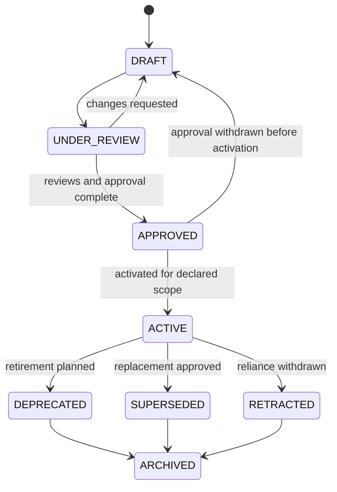

# Documentation Lifecycle

## Purpose

This specification defines publication lifecycle, document state, maturity, review cycles, transitions, approvals, supersession, deprecation, retraction, and archival rules.

## Independent Dimensions

Axodus documentation uses three independent dimensions:

- `publication_status` describes governance and publication progression.
- `document_state` describes whether content is current, obsolete, historical, or experimental.
- `maturity_level` describes documentary completeness and evidence.

No value in any dimension grants production or execution authority.

## Publication Lifecycle

| Status | Meaning | Authority |
|---|---|---|
| `DRAFT` | Content is being authored. | Non-authoritative. |
| `UNDER_REVIEW` | Content is stable enough for named reviewers. | Non-authoritative pending approval. |
| `APPROVED` | Required reviews and approval are recorded for the declared scope. | Normative for its scope but not necessarily public. |
| `ACTIVE` | Approved content is the current relied-upon documentation for its scope. | Current normative documentation. |
| `SUPERSEDED` | A newer governed document replaces it. | No longer current; retained as evidence. |
| `DEPRECATED` | Use is discouraged and planned for retirement without a full replacement. | Limited historical guidance only. |
| `ARCHIVED` | Closed historical evidence retained outside current guidance. | Historical only. |
| `RETRACTED` | Reliance is withdrawn due to defect, unsafe claim, invalid approval, or other serious issue. | Must not be relied upon. |

## Document State

| State | Meaning |
|---|---|
| `CURRENT` | Intended to represent the current applicable position. |
| `OBSOLETE` | No longer applicable as current guidance. |
| `HISTORICAL` | Retained to preserve evidence or context. |
| `EXPERIMENTAL` | Exploratory and not established as normative. |

Required combinations:

- `ACTIVE` MUST be `CURRENT`.
- `DRAFT` or `UNDER_REVIEW` MAY be `CURRENT` or `EXPERIMENTAL`.
- `SUPERSEDED` and `DEPRECATED` have effective state `OBSOLETE`.
- `ARCHIVED` MUST be `HISTORICAL`.
- `RETRACTED` MUST be `OBSOLETE` or `HISTORICAL`.

## Maturity Levels

| Level | Meaning |
|---|---|
| `UNASSESSED` | Documentary maturity has not been evaluated. |
| `D1` | Document is identified and has an initial purpose or content baseline. |
| `D2` | Structure, ownership, scope, and core metadata are defined. |
| `D3` | Content has relevant review, references, and traceability evidence. |
| `D3+` | Cross-domain review, risk treatment, and enhanced validation evidence exist. |
| `D4` | Document is fully governed, auditable, approved for its declared use, and sustainably maintained. |

Maturity is not a substitute for publication approval. An `ACTIVE` document can have known maturity limitations, and a `D4` artifact does not authorize production.

## Normal Transition Model

Skipping `UNDER_REVIEW` is forbidden for approval. Emergency retraction MAY occur from any relied-upon status with documented approver authority and rationale.

## Approval Requirements

- `DRAFT` requires an author and owner.
- Entry into `UNDER_REVIEW` requires assigned applicable reviewers and complete review scope.
- Entry into `APPROVED` requires completed applicable reviews, a named approver, resolved or accepted blockers, and a recorded review date.
- Entry into `ACTIVE` requires approval for the exact authority scope and confirmation that no conflicting current authority exists.
- Publication requires a separate publication decision even when status is `ACTIVE`.
- Financial, security, legal, governance, production, and execution-sensitive content requires the enhanced reviewers defined by the Authority Model.

## Review Cycles

| Cycle | Interval | Typical use |
|---|---|---|
| `QUARTERLY` | No more than three calendar months | Policies, standards, APIs, security, runbooks, and gate-sensitive documents |
| `SEMIANNUAL` | No more than six calendar months | Architecture, requirements, specifications, guides, and references |
| `ANNUAL` | No more than twelve calendar months | Research and stable contextual material |
| `EVENT_DRIVEN` | Triggered by a defined change | ADRs and immutable decisions |
| `NONE` | No recurring review | Closed reports, releases, meetings, and archived evidence |

An active document past `next_review` becomes `REVIEW_BLOCKED`. It remains current until reviewed, superseded, deprecated, or retracted, but it MUST NOT be newly promoted or published while overdue.

## Supersession

- A replacement declares the canonical IDs it `supersedes`.
- The reverse `superseded_by` relationship is derived; authors MUST NOT maintain both directions.
- The replacement MUST explain scope equivalence, partial replacement, or intentional differences.
- The old document remains retained and receives effective `SUPERSEDED`/`OBSOLETE` treatment.
- An approved ADR is immutable. Its replacement records `supersedes`; the old ADR file is not edited.
- Supersession MUST NOT reuse or transfer the old canonical ID.

## Deprecation

Deprecation is used when current reliance should end but no complete replacement is available.

- The reason, affected scope, migration guidance, and target retirement date MUST be recorded.
- Deprecated content MUST NOT be presented as preferred guidance.
- Deprecation does not delete history.
- If continued reliance is unsafe, use `RETRACTED`, not `DEPRECATED`.

## Retraction

- Retraction requires an accountable approver and recorded reason.
- Publicly exposed retracted content requires a separately authorized correction or rollback.
- Retraction MUST preserve evidence without exposing sensitive defect details.
- A corrected replacement receives a new version or new immutable record as required by document type.

## Archiving

- Archiving preserves identity, content, relationships, and approval evidence.
- Archived content MUST be excluded from current guidance and recurring review.
- Physical movement is optional and requires route/reference preservation when applicable.
- Location does not create archival status; lifecycle metadata does.
- Destructive removal requires a separate retention decision and is not part of this lifecycle.

## Related Architectural Decisions

- [DOC-ADR-002 — Separate Maturity and Publication State](../adr/DOC-ADR-002-MATURITY-AND-PUBLICATION-STATE.md)
- [DOC-ADR-007 — Documentation Releases](../adr/DOC-ADR-007-DOCUMENTATION-RELEASES.md)
- [DOC-ADR-008 — Retention and Historical Evidence](../adr/DOC-ADR-008-RETENTION-AND-HISTORICAL-EVIDENCE.md)
- [DOC-ADR-015 — Archiving Strategy](../adr/DOC-ADR-015-ARCHIVING-STRATEGY.md)

## Gate Preservation

Lifecycle transitions affect documentation only. They do not enable production, publication execution, financial activity, providers, credentials, wallets, contracts, APIs, or databases.
