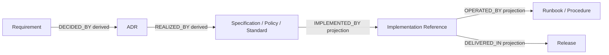

# Documentation Traceability Model

## Purpose

This specification defines typed relationships, cross-document traceability, implementation references, graph semantics, integrity constraints, and orphan policy.

## Traceability Principles

- Canonical document IDs identify graph nodes.
- Authored relationships are directed semantic edges.
- Reverse relationships are derived and MUST NOT be duplicated in source metadata.
- Only explicitly declared relationships are authoritative.
- A relationship records documentary evidence; it does not authorize implementation or execution.
- Physical proximity, Markdown links, matching titles, and filename similarity do not create semantic relationships.

## Relationship Object

```yaml
relationships:
  - type: "ADDRESSES"
    target: "DOC-REQ-001"
```

`type` and `target` are required. `target` SHOULD be a canonical document ID. An accepted alias MAY resolve to its canonical ID during future processing.

## Authored Relationship Types

| Type | Source meaning | Typical source → target | Derived inverse |
|---|---|---|---|
| `ADDRESSES` | Responds to a requirement, proposal, or problem statement. | ADR/RFC/PROPOSAL → REQUIREMENT | `DECIDED_BY` or `ADDRESSED_BY` |
| `REALIZES` | Provides normative realization of an upstream requirement or decision. | SPECIFICATION/POLICY/STANDARD/API → REQUIREMENT/ADR | `REALIZED_BY` |
| `DEPENDS_ON` | Requires the target to remain interpretable or applicable. | Any governed type → governed type | `REQUIRED_BY` |
| `VALIDATES` | Supplies review, assessment, audit, or verification evidence. | REPORT/REFERENCE → governed type | `VALIDATED_BY` |
| `OPERATES` | Provides controlled operational guidance for the target. | RUNBOOK/PLAYBOOK/PROCEDURE → API/SPECIFICATION/ARCHITECTURE | `OPERATED_BY` |
| `DELIVERS` | Includes the target in a governed release. | RELEASE → governed type | `DELIVERED_IN` |
| `SUPERSEDES` | Replaces all or a declared part of the target's authority. | New document → replaced document | `SUPERSEDED_BY` |
| `RELATES_TO` | Records a relevant non-hierarchical association. | Any governed type → governed type | `RELATED_FROM` |
| `GOVERNS` | Establishes mandatory policy or standard over the target. | POLICY/STANDARD/ADR → governed type | `GOVERNED_BY` |
| `DOCUMENTS` | Explains or records the target without governing it. | GUIDE/REFERENCE/REPORT/MEETING → governed type | `DOCUMENTED_BY` |
| `DERIVED_FROM` | Records that content was derived from identified documentary evidence. | Any governed type → governed type | `SOURCE_OF` |

Derived inverse labels are projections only and MUST NOT be authored as separate edges.

## Canonical Traceability Flow



Because decisions and historical records may be immutable, downstream documents author links to upstream sources. The graph may render inverse edges to present the left-to-right flow.

## Requirement Traceability

- An `ACTIVE` requirement MUST be addressed by at least one approved ADR, accepted RFC, or explicitly documented waiver.
- Acceptance criteria remain part of the requirement and MUST NOT be inferred from a downstream document.
- Requirement aliases MAY preserve external request IDs.
- A requirement's implementation status is separate from its documentary publication status.

## ADR Traceability

- An ADR SHOULD declare `ADDRESSES` relationships to the requirements or proposals that motivated it.
- A specification, policy, or standard implementing a decision declares `REALIZES` to that ADR.
- Approved ADRs are immutable; later relationships to them are authored by downstream documents.
- Supersession is declared only by the new ADR. Effective reverse state is derived.

## Specification and API Traceability

- An active specification MUST `REALIZES` at least one requirement, ADR, policy, or standard.
- An API SHOULD realize a specification and MAY depend on architecture.
- Implementation evidence belongs in `implementation_refs`, not as invented document nodes.
- A specification MUST NOT claim deployed behavior solely because an implementation reference exists.

## Implementation References

Each reference contains:

```yaml
implementation_refs:
  - repository: "Axodus/Core"
    path: "src/example"
    ref: "<immutable-commit-or-tag>"
    kind: "SOURCE"
    environment: "LOCAL"
```

Constraints:

- `repository`, `path`, `ref`, `kind`, and `environment` are required.
- `ref` SHOULD be immutable.
- Missing or inaccessible external evidence is reported as unresolved, not inferred.
- Production evidence may be referenced only when disclosure and approval permit it.
- A reference MUST NOT contain credentials, tokens, private endpoints, or secret values.
- A reference never grants authority to execute or mutate the target.

## Runbook and Playbook Relationships

- A runbook or procedure MUST `OPERATES` at least one API, specification, architecture, or governed component document.
- A playbook MUST relate to the policy, procedure, runbook, or scoped artifact governing its scenario.
- Operational documentation MUST preserve the execution gates of its referenced documents.

## Release Relationships

- A release MUST `DELIVERS` at least one governed document.
- It SHOULD reference validation reports using `DEPENDS_ON` or `RELATES_TO`.
- Release membership does not change a document's authority or production status.
- Publication of a release remains separately authorized.

## Supersession Constraints

- `SUPERSEDES` MUST NOT target the source itself.
- A supersession cycle is invalid.
- The new document MUST have authority applicable to the replaced scope.
- Partial supersession MUST be explained in document content.
- `supersedes` in canonical front matter and `SUPERSEDES` relationships represent the same semantics and MUST agree.

## Referential Integrity

- A target MUST resolve to one canonical ID.
- A canonical ID or alias MUST NOT resolve to multiple documents.
- Duplicate identical edges from one source are invalid.
- Conflicting edges MUST be reported for review rather than automatically resolved.
- Missing targets remain unresolved references.
- Markdown links do not satisfy typed relationship requirements.

## Document Orphan Policy

A governed document is an orphan when either condition holds:

1. it is not reachable from `DOCUMENTATION-MASTER-INDEX.md`; or
2. it has no incoming or outgoing semantic relationship.

The master index itself is exempt. A generated or manually maintained index entry provides reachability but does not count as a semantic relationship.

New `DRAFT` documents MAY be temporarily orphaned while being prepared. A document MUST NOT become `APPROVED` or `ACTIVE` while orphaned unless its type is explicitly exempted by a later approved policy. Closed historical records still require contextual relationships.

## Cycle Policy

- `SUPERSEDES` cycles are forbidden.
- `DEPENDS_ON` cycles are presumptively invalid and require architectural review.
- `REALIZES`, `ADDRESSES`, `DELIVERS`, and `OPERATES` cycles are invalid.
- `RELATES_TO` cycles are allowed because the relation is non-hierarchical.
- Potential cycles are reported; no inference engine is defined here.

## Conflict Handling

Relationship disagreement does not change authority automatically. Conflicts are resolved using the Documentation Authority Model and recorded in the Documentation Conflict Register when unresolved.

## Related Architectural Decisions

- [DOC-ADR-004 — Cross-Document Traceability](../adr/DOC-ADR-004-CROSS-DOCUMENT-TRACEABILITY.md)
- [DOC-ADR-005 — Metadata Schema Architecture](../adr/DOC-ADR-005-METADATA-SCHEMA-ARCHITECTURE.md)
- [DOC-ADR-008 — Retention and Historical Evidence](../adr/DOC-ADR-008-RETENTION-AND-HISTORICAL-EVIDENCE.md)
- [DOC-ADR-011 — Required Metadata](../adr/DOC-ADR-011-REQUIRED-METADATA.md)

## Non-Implementation Boundary

This specification does not generate, validate, or visualize a graph. It defines the contract for a future separately authorized implementation.
